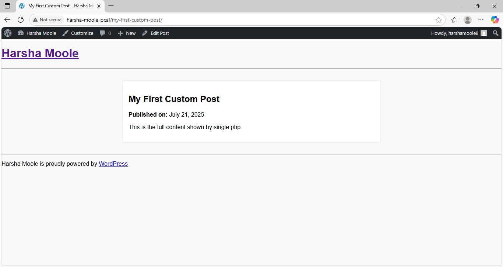

# HarshaMoole Blog Theme 🎨

A minimal and responsive custom WordPress blog theme built from scratch as part of the rtCamp Associate Software Engineer application process.

---

## 🌐 Live Preview

---

## 🧠 About the Project

This theme was built to understand the fundamentals of WordPress theme development — no page builders, no plugins — just clean PHP, HTML, and CSS. It follows WordPress theme structure guidelines and supports blog posts with a fully functional homepage and single post view.

---

## 📁 Theme Structure

harshamoole-wp-blog-theme/
├── style.css # Theme info and basic styles
├── index.php # Homepage and blog post loop
├── single.php # Individual blog post layout
├── header.php # Site header
├── footer.php # Site footer
├── functions.php # Enqueue styles and theme support
├── screenshot.png # WP Admin preview

---

## ✨ Features

- Custom header and footer
- Blog post listing on homepage (`index.php`)
- Single post view (`single.php`)
- Responsive and minimal layout
- Screenshot preview in Appearance → Themes
- Clean code and easily extendable

---

## 🚀 How to Use

1. Clone this repository or download the ZIP  
2. Copy the folder to your local WordPress `wp-content/themes/` directory  
3. Open WordPress Admin (`/wp-admin`) → Appearance → Themes  
4. Activate **HarshaMoole Blog Theme**

✅ That's it!

---

## 💡 Built With

- HTML & CSS
- PHP (WordPress Theme Functions)
- Local by Flywheel (for testing)
- WordPress (Classic CMS)

---

## 📬 Connect With Me

- 💼 [LinkedIn](https://linkedin.com/in/harsha-moole-76343b371)
- 💻 [GitHub](https://github.com/harshamoole)

---

## 📌 License

This theme is open-source and free to use for learning and showcasing. Feel free to fork and modify!
